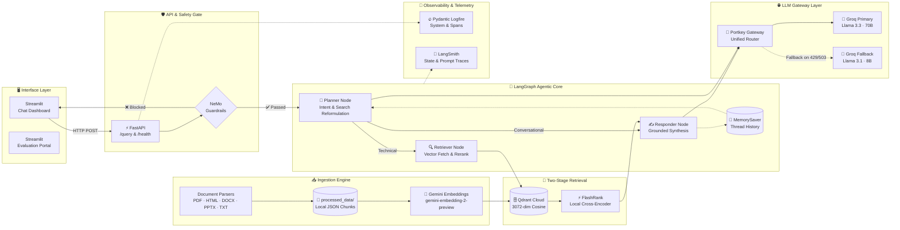
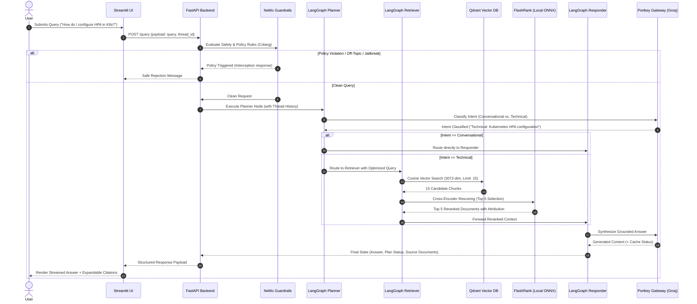
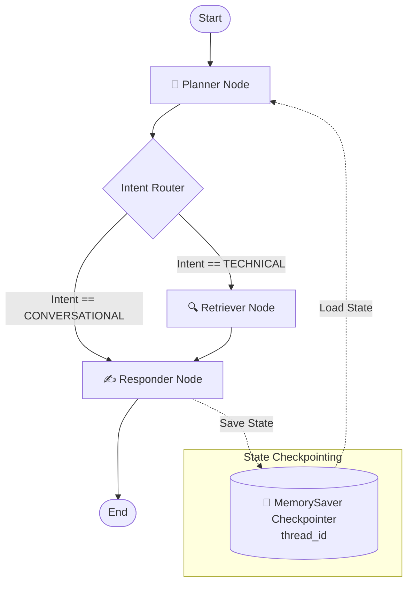
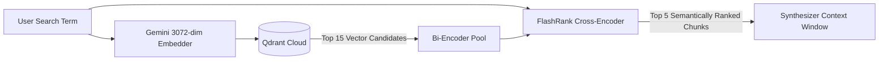
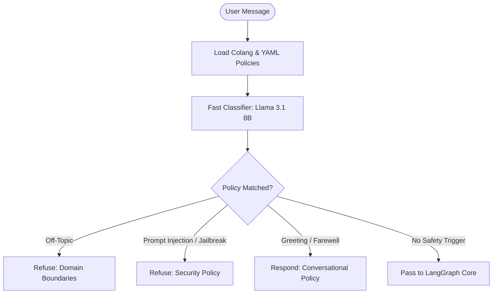
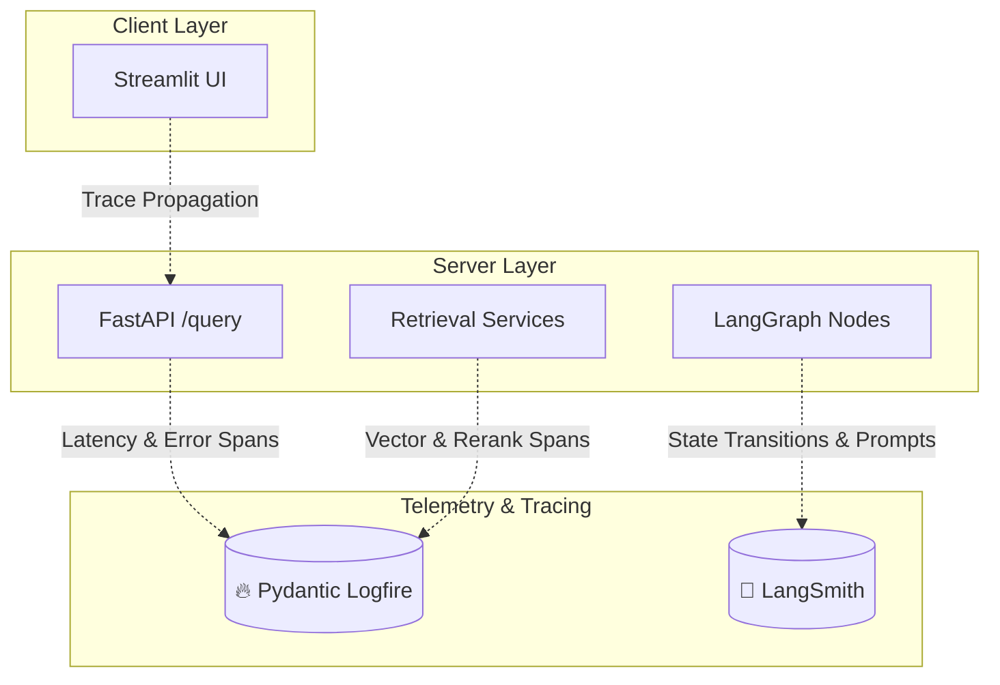

# NEXUS-RAG: Architecture & Technical Design

### Anuj's Enterprise eXplainable Unified Search & RAG
**Author:** Anuj Kekre  
**Platform Version:** 1.0.0

---

## 1. System Overview

**NEXUS-RAG** is an agentic document intelligence platform architected for deterministic precision, low latency, and deep observability across enterprise document repositories. The architecture decouples the request pipeline into distinct, specialized layers:

1. **Interface Layer**: Interactive Streamlit application providing real-time telemetry and source inspection.
2. **API & Safety Gate**: High-performance FastAPI server integrated with an NVIDIA NeMo Guardrails policy barrier.
3. **Agentic Reasoning Core**: LangGraph state machine orchestrating intent classification, adaptive query planning, and context synthesis.
4. **Two-Stage Retrieval Layer**: High-dimensional vector search via Qdrant Cloud combined with local, CPU-based cross-encoder reranking via FlashRank.
5. **LLM Gateway Layer**: Portkey AI gateway managing routing, retries, fallback strategies, and semantic response caching.
6. **Telemetry & Observability Layer**: Dual tracing using Pydantic Logfire and LangSmith across all graph nodes and infrastructure components.



---

## 2. Request Lifecycle

The end-to-end execution lifecycle of a query in NEXUS-RAG proceeds through the following sequence:



---

## 3. Agent Graph

NEXUS-RAG utilizes a state graph built on **LangGraph**, enabling deterministic conditional routing, node state updates, and session checkpointing.



### State Schema (`AgentState`)
```python
class AgentState(TypedDict):
    messages: Annotated[List[dict], operator.add]  # Appending message history reducer
    current_query: str                             # Formulated search term or 'CONVERSATIONAL'
    documents: List[str]                           # Retrieved & reranked context chunks
    plan: List[str]                                # Execution status indicators
    status: str                                    # High-level operational message
    final_answer: str                              # Grounded output synthesized for user
```

---

## 4. Retrieval Architecture

Naïve RAG systems rely on single-stage vector similarity, which suffers from semantic ambiguity and false positives. NEXUS-RAG implements a **Two-Stage Hybrid Retrieval Pipeline**:

1. **Stage 1 — High-Recall Bi-Encoder (Qdrant Cloud)**:
   - Query is embedded into 3072 dimensions using Gemini.
   - Vector search computes Cosine Similarity over millions of vectors in `<10ms`.
   - Returns a wide candidate pool of **top 15** document chunks.
2. **Stage 2 — High-Precision Cross-Encoder (FlashRank)**:
   - The query and each candidate chunk are fed jointly into the cross-encoder (`ms-marco-MiniLM-L-6-v2`).
   - Cross-attention evaluates token-to-token semantic interactions.
   - Filters out distractors and extracts the **top 5** most concentrated context passages.



---

## 5. Embedding Pipeline

- **Model**: Google Gemini `gemini-embedding-2-preview` (3072 dimensions).
- **Batch Processing**: Configured with a chunk batch size of 50 for efficient throughput.
- **Resiliency**: Built-in exponential backoff retry mechanism (1s, 2s, 4s, 8s) to automatically absorb burst rate limits (`429 / RESOURCE_EXHAUSTED`).
- **Local Fallback**: Gracefully falls back to local `sentence-transformers` (`all-mpnet-base-v2`, 768 dimensions) if cloud API access is unavailable.

---

## 6. Vector Database

- **Engine**: **Qdrant Cloud**.
- **Collection**: `nexus_rag_knowledge` (configurable via `QDRANT_COLLECTION`).
- **Metric**: Cosine Distance (`Distance.COSINE`).
- **Payload Schema**:
  - `text`: Chunk text body.
  - `source`: Source document filename.
  - `source_type`: Data partition tag (`true` vs `noisy`).
- **Query Interface**: Uses modern point query endpoint (`query_points`) with automatic payload hydration.

---

## 7. Reranking

- **Engine**: **FlashRank**.
- **Model**: Quantized ONNX `ms-marco-MiniLM-L-6-v2`.
- **Execution**: Local CPU-bound inference (`<100ms`).
- **Architecture Rationale**:
  - Eliminates per-call external API fees (e.g., Cohere Rerank).
  - Eliminates network round-trip overhead.
  - Keeps enterprise document chunks entirely on-premise during the reranking phase.
  - Custom fallback logic catches any runtime model initialization exceptions and reverts to Qdrant rankings without crashing the user session.

---

## 8. Guardrails

Safety is enforced via **NVIDIA NeMo Guardrails** as a deterministic barrier before any vector retrieval or reasoning occurs:



- **Colang Safety Rules**:
  - `user ask off topic`: Blocks casual non-technical requests (recipes, poetry, sports).
  - `user attempt jailbreak`: Neutralizes "DAN mode", system prompt bypasses, and instruction overrides.
  - `user express greeting / capabilities`: Returns standardized enterprise assistance summaries.
- **Indicator Detection**: Multi-phrase regex and substring validation verifying if a safety rail fired.

---

## 9. LLM Gateway

All LLM requests are managed through **Portkey AI Gateway**:

- **Unified Proxy**: Exposes an OpenAI-compatible interface backed by Groq high-speed hardware.
- **Primary Model**: `@rag/llama-3.3-70b-versatile` (70B parameter dense reasoning).
- **Fallback Model**: `@brag/llama-3.1-8b-instant` (automatic failover on HTTP 429 / 503).
- **Retry Policy**: 2 automated retries with exponential backoff on transient errors.
- **Semantic Caching**: Edge caching enabled; response headers (`x-portkey-cache-status`) are inspected to report Cache Hit telemetry in the user interface.

---

## 10. Memory

- **Checkpointer**: LangGraph `MemorySaver`.
- **Session Identification**: Unique UUID-based `thread_id` generated per browser session.
- **History Reduction**: The `messages` key in `AgentState` utilizes `operator.add` to immutably append dialogue turns.
- **Memory Persistence**: Planner inspects historical conversation context to resolve anaphoric references (e.g., "What was the second step you mentioned?").

---

## 11. Observability



1. **Pydantic Logfire**:
   - Initialized at the root before module loading to prevent trace poisoning.
   - Traces FastAPI HTTP endpoints, Qdrant vector latency, FlashRank inference times, and chunking performance.
2. **LangSmith**:
   - Records prompt versions, token consumption, and state transitions between Planner, Retriever, and Responder nodes.

---

## 12. Evaluation

NEXUS-RAG integrates an evaluation framework combining **RAGAS** with custom deterministic metrics:

| Metric | Target | Evaluation Mechanism |
| :--- | :--- | :--- |
| **Faithfulness** | `> 0.85` | Judge LLM scores whether response claims are strictly entailed by context chunks. |
| **Answer Relevancy** | `> 0.80` | Measures embedding similarity between generated response and input query. |
| **Context Precision** | `> 0.80` | Measures ranking position of relevant context chunks within retrieved set. |
| **Context Recall** | `> 0.85` | Verifies whether all reference ground-truth facts were present in retrieved context. |
| **Answer Correctness** | `> 0.85` | Factual accuracy and semantic overlap against expert reference answers. |
| **Tool Selection** | `1.00` | Deterministic Jaccard similarity: `|Actual Tools ∩ Expected Tools| / |Actual Tools ∪ Expected Tools|`. |
| **Guardrails Accuracy**| `> 0.95` | Binary confusion matrix (TP, TN, FP, FN) on adversarial test suites. |

---

## 13. Failure Handling & Resiliency

| Potential Failure Point | Automated Mitigation Strategy |
| :--- | :--- |
| **Qdrant Vector DB Unavailable** | Catches connection errors, logs span, and returns safe empty candidate list allowing conversational fallback. |
| **FlashRank Model Load Error** | Gracefully catches exceptions and reverts to Qdrant vector similarity ordering without breaking user workflow. |
| **Gemini Rate Limit (429)** | 4-tier exponential backoff (1s → 2s → 4s → 8s) before falling back to local SentenceTransformer embeddings. |
| **Groq API Outage / Rate Limit** | Portkey Gateway automatically executes fallback routing from 70B versatile to 8B instant model. |
| **Empty Search Results** | Responder node detects empty context and provides honest, constructive guidance rather than hallucinating answers. |
| **Prompt Injection Attempt** | NeMo Guardrails intercepts prompt prior to agent execution, returning policy refusal with zero backend token consumption. |
