# ⚡ NEXUS-RAG: System Overview

### Anuj's Enterprise eXplainable Unified Search & RAG
**Author:** Anuj Kekre

A production-grade, state-of-the-art agentic RAG system built for precision, high throughput, and deep observability. This platform leverages **LangGraph** to execute cyclic reasoning, adaptive query planning, and a fully local, zero-API-cost reranking stack for document intelligence.

---

## 🌟 Vision
Most RAG systems fail because they treat every query identically. **NEXUS-RAG** distinguishes between:
1. **Conversational Queries**: "Hi", "Who are you?", "What was the previous command you recommended?"
2. **Technical Queries**: "How do I configure Vertical Pod Autoscaler in Kubernetes?"

By utilizing a **Planner-Retriever-Responder** architecture, we ensure that technical answers are always grounded in verified enterprise context while conversational interactions remain fluid, contextual, and fast.

---

## 🏗️ High-Level Flow

```mermaid
sequenceDiagram
    participant User
    participant UI as Streamlit UI
    participant Agent as NEXUS-RAG Brain (FastAPI)
    participant Data as Knowledge Base (Qdrant)

    User->>UI: Asks Question
    UI->>Agent: Request with thread_id
    Agent->>Agent: Planner evaluates intent & memory
    alt Technical Query
        Agent->>Data: Vector Search (Gemini Embeddings)
        Data-->>Agent: Raw Candidate Chunks
        Agent->>Agent: FlashRank Local Reranking
    else Conversational
        Agent->>Agent: Recall Conversational Memory
    end
    Agent->>User: Synthesized Answer + Grounding Sources
```

---

## 📂 Project Organization
* **`app/`**: Core Python package containing LangGraph agent, gateway, guardrails, ingestion, and services.
* **`ui/`**: Streamlit dashboard with real-time telemetry, session management, and source inspection.
* **`evals/`**: Comprehensive RAGAS evaluation suite and metrics portal.
* **`DATA/`**: Ground-truth documentation and noise datasets for ingestion.
* **`DOCS/`**: Architectural and operational documentation suite.

---

## 🚀 Quick Navigation
1. **Ingestion Engine**: [02_INGESTION_ENGINE.md](02_INGESTION_ENGINE.md)
2. **Node Intelligence**: [03_NODE_INTELLIGENCE.md](03_NODE_INTELLIGENCE.md)
3. **Observability**: [04_TRACING_AND_OBSERVABILITY.md](04_TRACING_AND_OBSERVABILITY.md)
4. **Environment Variables**: [05_ENVIRONMENT_VARIABLES.md](05_ENVIRONMENT_VARIABLES.md)
5. **FlashRank Reranking**: [07_FLASHRANK_RERANKING.md](07_FLASHRANK_RERANKING.md)
6. **Guardrails**: [08_GUARDRAILS.md](08_GUARDRAILS.md)
7. **LLM Gateway**: [09_LLM_GATEWAY.md](09_LLM_GATEWAY.md)
8. **Evals & Benchmark**: [10_EVALS.md](10_EVALS.md)

