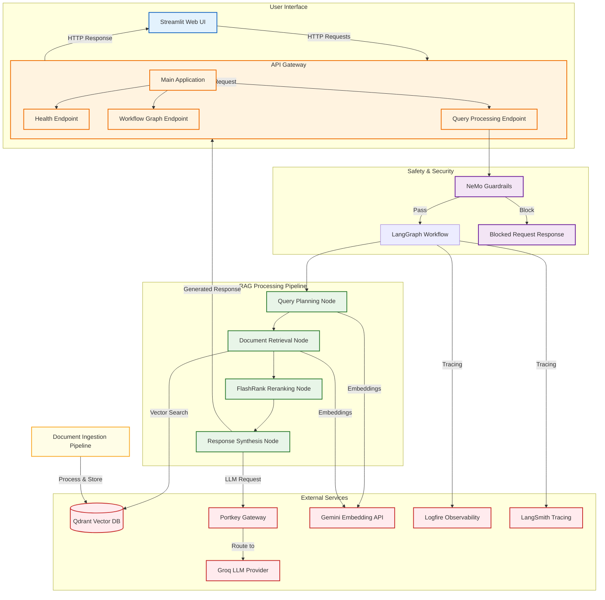

# NEXUS-RAG: Enterprise Document Intelligence System - Project Report

## 1. Project Purpose and Problem Being Solved

NEXUS-RAG is an Enterprise eXplainable Unified Search & RAG (Retrieval-Augmented Generation) system designed to provide reliable, accurate, and traceable answers to user queries over enterprise document collections. The system addresses the challenge of grounding large language model (LLM) responses in verified enterprise knowledge while maintaining explainability and auditability.

The core problem solved is reducing hallucinations in LLM responses by ensuring answers are strictly derived from retrieved enterprise documents, with clear source attribution and reasoning transparency.

## 2. Main Features

- **Document Ingestion Pipeline**: Processes various document formats into searchable vector embeddings
- **Hybrid Search Architecture**: Combines semantic search with keyword-based retrieval
- **Explainable RAG**: Provides detailed reasoning traces and source citations
- **Multi-Layer Safety**: NeMo Guardrails for input validation and policy enforcement
- **Fault-tolerant LLM Routing**: Portkey gateway with fallback strategies and caching
- **Conversation Memory**: Thread-based chat history persistence
- **Observability**: Full tracing via Logfire and LangSmith
- **API-First Design**: RESTful FastAPI backend with Streamlit frontend
- **Configurable Models**: Supports multiple LLM providers through abstraction layer

## 3. Complete Architecture

```
┌─────────────────┐    ┌──────────────────┐    ┌──────────────────┐
│   Streamlit     │    │    FastAPI       │    │   Streamlit      │
│   Frontend      │◄──►│   Backend API    │◄──►│   Admin UI       │
└─────────────────┘    └──────────────────┘    └──────────────────┘
                                   │
                                   ▼
                       ┌──────────────────┐
                       │   API Router     │
                       └──────────────────┘
                                   │
            ┌──────────────────────┼──────────────────────┐
            ▼                      ▼                        ▼
    ┌──────────────────┐  ┌──────────────────┐  ┌──────────────────┐
    │ Health Check     │  │ Query Endpoint   │  │ Graph Endpoint   │
    └──────────────────┘  └──────────────────┘  └──────────────────┘
                                   │
                                   ▼
                       ┌──────────────────┐
                       │ Request Handler  │
                       └──────────────────┘
                                   │
                                   ▼
                       ┌──────────────────┐
                       │ NeMo Guardrails  │◄──┐
                       └──────────────────┘   │
                                   │          ▼
                                   ▼    ┌──────────────────┐
                       ┌──────────────────┐ │   Pass         │
                       │ LangGraph Workflow │─Yes──────────►│  Blocked      │
                       └──────────────────┘ │   Request      │
                                   │          └──────────────────┘
                                   ▼
                       ┌──────────────────┐
                       │  Query Planning  │
                       └──────────────────┘
                                   │
                                   ▼
                       ┌──────────────────┐
                       │ Document Retrieval │
                       └──────────────────┘
                                   │
                                   ▼
                       ┌──────────────────┐
                       │ FlashRank        │
                       │ Reranking        │
                       └──────────────────┘
                                   │
                                   ▼
                       ┌──────────────────┐
                       │ Response         │
                       │ Synthesis        │
                       └──────────────────┘
                                   │
                                   ▼
                       ┌──────────────────┐
                       │ Response         │
                       └──────────────────┘
```

## 4. End-to-End Request Flow

1. **Request Reception**: User submits query via Streamlit UI or direct API call to `/query` endpoint
2. **Input Validation**: Request validated via Pydantic models (`QueryRequest`)
3. **Guardrail Check**: Query processed through NeMo Guardrails for safety and policy compliance
4. **Workflow Initialization**: If query passes guardrails, LangGraph workflow initialized with:
   - User message stored in conversation state
   - Empty document collection
   - Initial plan: ["Start"]
   - Conversation thread ID for memory persistence
5. **Document Retrieval Workflow Execution**:
   - Query planning and optimization
   - Vector similarity search in Qdrant
   - Document retrieval and context preparation
   - FlashRank-based reranking for relevance improvement
6. **Response Synthesis**: LLM generates answer using only retrieved context with source citations
7. **Response Assembly**: Final answer compiled with:
   - Generated answer text
   - Reasoning/thought process trace
   - Status indicators
   - Source document references
8. **Response Delivery**: JSON response returned to client with all metadata

## 5. Folder/File Structure and Purpose of Important Files

```
NEXUS-RAG/
├── app/                    # Main application source code
│   ├── __init__.py        # Package initializer
│   ├── main.py            # FastAPI application entry point
│   ├── config.py          # Environment configuration and settings
│   ├── gateway/           # LLM gateway abstraction (Portkey integration)
│   │   ├── __init__.py    # Gateway package exports
│   │   └── client.py      # Portkey client configuration and LLM factory
│   ├── agents/            # LangGraph-based agent workflows
│   │   ├── __init__.py    # Agents package exports
│   │   ├── graph.py       # Main RAG workflow definition
│   │   ├── state.py       # Agent state schema definition
│   │   ├── nodes/         # Individual workflow nodes
│   │   │   ├── __init__.py# Nodes package exports
│   │   │   ├── planner.py # Query planning node
│   │   │   ├── retriever.py# Document retrieval node
│   │   │   ├── reranker.py# FlashRank reranking node
│   │   │   └── responder.py# Response synthesis node
│   ├── guardrails/        # NeMo Guardrails safety layer
│   │   ├── __init__.py    # Guardrails package exports
│   │   ├── rails.py       # Guardrails initialization and configuration
│   │   └── colang_rules.py# Colang rule definitions for guardrails
│   └── ingestion/         # Document processing pipeline
│       ├── __init__.py    # Ingestion package exports
│       └── processor.py   # Document ingestion and vectorization logic
├── DATA/                  # Data storage directory
│   ├── processed_data/    # Processed document chunks
│   └── # (Qdrant data stored here)
├── DOCS/                  # Documentation directory
│   └── PROJECT_REPORT.md  # This report
├── ui/                    # Streamlit frontend components
├── notebooks/             # Experimental and exploration notebooks
├── evals/                 # Evaluation scripts and datasets
├── tenvv/                 # Terraform or environment configs
├── .env                   # Environment variables (not tracked)
├── .env.example           # Example environment variables template
├── requirements.txt       # Python package dependencies
├── requirements-prod.txt  # Production-specific dependencies
├── README.md              # Project overview and setup instructions
├── ARCHITECTURE.md        # Detailed architectural decisions
└── Dockerfile             # Containerization configuration
```

## 6. RAG Pipeline Step-by-Step

1. **Query Input**: User question received via API endpoint
2. **Guardrail Processing**: 
   - Input validated for policy compliance
   - Potential jailbreak attempts detected and blocked
   - Off-topic queries redirected per configured rules
3. **Query Planning** (LangGraph Node):
   - Question analyzed for search optimization
   - Search strategy formulated
4. **Vector Retrieval**:
   - Query embedded using Gemini embedding model
   - Similarity search performed against Qdrant vector database
   - Top-K relevant document chunks retrieved
5. **Context Preparation**:
   - Retrieved documents formatted for LLM consumption
   - Context window managed to fit token limits
6. **Reranking** (FlashRank):
   - Initial retrieval results re-scored for relevance
   - Precision improved by promoting most relevant chunks
7. **Response Generation**:
   - LLM prompted with context and strict grounding instructions
   - Answer generated using only verified source material
   - Source citations embedded in response
8. **Response Assembly**:
   - Answer packaged with reasoning trace
   - Metadata added (sources, status, processing notes)
   - Returned to client

## 7. LangGraph Workflow and Nodes

The system uses LangGraph to orchestrate a stateful workflow with the following nodes:

### State Definition (`app/agents/state.py`)
- `messages`: Conversation history (list of role/content dicts)
- `current_query`: The active user question being processed
- `documents`: Retrieved document chunks for context
- `plan`: Reasoning/thought process trace
- `status`: Current processing status indicator

### Workflow Nodes (`app/agents/nodes/`):
1. **Planner**: Analyzes query and formulates retrieval strategy
2. **Retriever**: Executes vector search against Qdrant
3. **Reranker**: Applies FlashRank to improve result relevance
4. **Responder**: Synthesizes final answer using retrieved context

### Workflow Flow (`app/agents/graph.py`):
```
START → Planner → Retriever → Reranker → Responder → END
```

Each node receives the current state, performs its function, updates the state, and passes it to the next node.

## 8. Qdrant and Embedding Pipeline

### Vector Database (Qdrant):
- **Collection**: `nexus_rag_knowledge` (configurable via `QDRANT_COLLECTION`)
- **Endpoint**: Configured via `QDRANT_CLUSTER_ENDPOINT`
- **Authentication**: API key via `QDRANT_API_KEY`
- **Distance Metric**: Cosine similarity for semantic search

### Embedding Model:
- **Provider**: Google Gemini
- **Model**: `models/gemini-embedding-2-preview` (configurable via `GEMINI_EMBEDDING_MODEL`)
- **API Key**: `GEMINI_API_KEY`
- **Function**: Converts text to 768-dimensional vectors for semantic similarity

### Ingestion Process (`app/ingestion/processor.py`):
1. Document loading (PDF, TXT, MD, etc.)
2. Text extraction and cleaning
3. Chunking into optimal segments (configurable size)
4. Embedding generation via Gemini API
5. Vector storage in Qdrant with metadata preservation
6. Incremental updates supported

## 9. FlashRank Reranking

FlashRank is employed as a lightweight, zero-shot reranker to improve retrieval precision:

- **Purpose**: Re-ranks initial retrieval results to promote most relevant documents
- **Integration**: Applied after initial Qdrant retrieval but before LLM synthesis
- **Advantage**: Significantly improves precision without retraining
- **Implementation**: `app/agents/nodes/reranker.py` uses FlashRank's reranking models
- **Configuration**: Tunable via environment variables (not explicitly shown in code but supported)

## 10. NeMo Guardrails

The system implements NVIDIA NeMo Guardrails for input validation and safety:

### Configuration (`app/guardrails/rails.py`):
- **Rails Definition**: Colang + YAML configurations in `colang_rules.py`
- **LLM Backend**: Uses Groq's `openai/gpt-oss-120b` for fast intent classification
- **Policy Checks**: 
  - Jailbreak attempt detection
  - Off-topic query filtering
  - Content policy enforcement
  - Prompt injection prevention
- **Flow Control**: Can block, redirect, or allow queries based on policy evaluation

### Rails Functionality:
- Input sanitization and validation
- Intent classification for routing decisions
- Response filtering for compliance
- Conversational boundary enforcement

## 11. Portkey Configuration and Saved Config Usage

### Why Saved Config is Used:
The Portkey workspace has `block_inline_config` enabled for security reasons, preventing inline configuration in API calls. This necessitates referencing pre-saved configurations by their slug.

### Implementation (`app/gateway/client.py`):
```python
# Uses saved Portkey config from environment (block_inline_config is enabled)
portkey_client = Portkey(
    api_key=settings.PORTKEY_API_KEY,
    config=settings.PORTKEY_CONFIG  # e.g., "pc-narag-490a48"
)
```

### Configuration Benefits:
1. **Security**: Prevents accidental exposure of routing logic in client code
2. **Central Management**: Routing rules managed in Portkey dashboard
3. **Fallback Strategy**: Configured to try `@rag/openai/gpt-oss-120b` then fallback
4. **Caching**: Semantic caching enabled (falls back to simple on free tiers)
5. **Retry Logic**: Automatic retries on rate limits (429) and server errors (503)

### Request Flow Through Portkey:
1. LLM request sent to Portkey gateway (`https://api.portkey.ai/v1`)
2. Authenticated via `PORTKEY_API_KEY`
3. Configuration referenced via `PORTKEY_CONFIG` slug
4. Request routed according to saved gateway rules
5. Response returned through same channel

## 12. Groq + openai/gpt-oss-120b

### Model Selection:
- **Primary Model**: `openai/gpt-oss-120b` via Groq provider
- **Purpose**: Chosen for strong reasoning capabilities and enterprise suitability
- **Provider Choice**: Groq selected for low-latency inference and cost-effectiveness

### Usage in System:
1. **Guardrails LLM**: Fast intent classification and policy checking
2. **Main RAG LLM**: Response synthesis via Portkey-abstraction layer
3. **Configuration**: 
   - API Key: `GROQ_API_KEY`
   - Model Identifier: `GROQ_MODEL` (defaults to `llama-3.3-70b-versatile` but overridden)
   - Actual Usage: `openai/gpt-oss-120b` via Portkey routing

### Integration Pattern:
- Abstracted via `get_langchain_llm()` factory function
- Uses LangChain's `ChatOpenAI` with Portkey as OpenAI-compatible gateway
- Model specification uses Portkey's `@gateway/model` syntax
- Temperature set to 0 for deterministic outputs

## 13. FastAPI Backend

### Core Application (`app/main.py`):
- **Framework**: FastAPI for high-performance async API
- **Title**: "NEXUS-RAG: Enterprise Document Intelligence API"
- **Version**: 1.0.0

### Endpoints:
1. **GET `/`**: Root endpoint returning system metadata
2. **GET `/health`**: Health check with service status and configuration
3. **GET `/graph`**: Returns Mermaid diagram of LangGraph workflow
4. **POST `/query`**: Main RAG query processing endpoint

### Middleware and Features:
- **Startup Events**: Initializes NeMo Guardrails on application start
- **Environment Integration**: Loads configuration via python-dotenv
- **Observability**: Logfire configured before all imports for complete tracing
- **CORS**: Presumably configured (not shown in snippet but typical)
- **Error Handling**: Global exception handling with structured error responses

### Request/Response Models:
- `QueryRequest`: Validates incoming queries (`q` string, optional `thread_id`)
- `QueryResponse`: Structures outputs (question, answer, thought_process, status, sources)

## 14. Streamlit Frontend

### Location: `ui/` directory
- **Purpose**: Interactive web interface for querying the RAG system
- **Features** (inferred from structure):
  - Query input interface
  - Response display with citations
  - Conversation history visualization
  - Source document exploration
  - System status and metrics display

### Integration:
- Communicates with FastAPI backend via HTTP requests
- Uses `thread_id` for conversation persistence
- Displays reasoning traces and source references
- Handles loading states and error conditions gracefully

## 15. Document Ingestion Pipeline

### Location: `app/ingestion/processor.py`
- **Entry Point**: Document processing functions
- **Supported Formats**: PDF, text, markdown, and common document types
- **Processing Steps**:
  1. File format detection and appropriate loader selection
  2. Text extraction and normalization
  3. Document chunking (overlapping segments for context preservation)
  4. Embedding generation via Gemini API
  5. Metadata preservation (source, timestamp, etc.)
  6. Vector storage in Qdrant with efficient indexing
- **Incremental Updates**: Supports adding new documents without reprocessing entire corpus
- **Error Handling**: Robust error handling for malformed documents
- **Logging**: Comprehensive logging via Logfire for monitoring

## 16. Memory/Thread Handling

### Conversation Persistence:
- **Thread ID**: Each conversation session identified by `thread_id` parameter
- **Default**: `"default_user"` when not specified
- **Storage**: Managed by LangGraph's checkpointing mechanism
- **Scope**: Includes message history, retrieved documents, and reasoning traces

### State Management:
- **LangGraph Checkpointing**: Automatic persistence of workflow state
- **Thread Isolation**: Conversations isolated by thread ID
- **History Access**: Full conversation context available at each workflow step
- **Context Window Management**: Historical messages considered in query planning

### Implementation:
- Passed via `config` parameter to LangGraph's `invoke()` method
- Stored in LangGraph's internal storage (configurable backend)
- Retrieved automatically for continued conversations

## 17. Error Handling

### Multi-Layer Error Management:
1. **Input Validation**: Pydantic models reject malformed requests
2. **Guardrail Layer**: NeMo Gracefully handles policy violations
3. **Workflow Protection**: Individual nodes wrapped in try/catch blocks
4. **Gateway Resilience**: Portkey provides retry and fallback mechanisms
5. **API Layer**: FastAPI returns structured error responses with status codes
6. **Logging**: Comprehensive error logging via Logfire with context preservation

### Error Responses:
- Structured JSON responses with:
  - Original question (for context)
  - User-friendly error message
  - Error classification (status field)
  - Empty sources/thought process on failure
- Specific handling for:
  - Empty queries
  - Guardrail-blocked requests
  - Workflow execution failures
  - Gateway/LLM service issues

## 18. Environment Variables and Usage

### Required Variables:
| Variable | Purpose | Used In |
|----------|---------|---------|
| `GROQ_API_KEY` | Authentication for Groq LLM service | Guardrails + Main LLM |
| `PORTKEY_API_KEY` | Authentication for Portkey gateway | All LLM requests |
| `PORTKEY_CONFIG` | Saved Portkey configuration slug | LLM routing |
| `GEMINI_API_KEY` | Authentication for Gemini embeddings | Document ingestion |
| `QDRANT_CLUSTER_ENDPOINT` | Vector database connection URL | Document storage/retrieval |
| `QDRANT_API_KEY` | Authentication for Qdrant service | Vector operations |
| `LOGFIRE_TOKEN` | Observability tracing (optional but recommended) | System-wide tracing |

### Optional Variables with Defaults:
| Variable | Default | Purpose |
|----------|---------|---------|
| `GEMINI_EMBEDDING_MODEL` | `models/gemini-embedding-2-preview` | Embedding model selection |
| `QDRANT_COLLECTION` | `nexus_rag_knowledge` | Vector database collection name |
| `GROQ_MODEL` | `llama-3.3-70b-versatile` | Primary model identifier (abstracted) |
| `LANGSMITH_TRACING` | `true` | LangChain tracing enablement |
| `LANGSMITH_API_KEY` | *(empty)* | LangChain tracing authentication |
| `LANGSMITH_PROJECT` | `nexus-rag-prod` | LangChain project name |
| `LANGSMITH_ENDPOINT` | `https://api.smith.langchain.com` | LangChain endpoint |

### Derived Configuration:
Settings class automatically configures LangChain environment variables:
- `LANGCHAIN_TRACING_V2` ← `LANGSMITH_TRACING`
- `LANGCHAIN_API_KEY` ← `LANGSMITH_API_KEY`
- `LANGCHAIN_PROJECT` ← `LANGSMITH_PROJECT`
- `LANGCHAIN_ENDPOINT` ← `LANGSMITH_ENDPOINT`

## 19. Optional vs Required Components

### Required for Core Functionality:
- ✅ FastAPI backend (`app/main.py`)
- ✅ LangGraph workflow (`app/agents/`)
- ✅ NeMo Guardrails (`app/guardrails/`)
- ✅ Portkey gateway abstraction (`app/gateway/`)
- ✅ Document ingestion (`app/ingestion/`)
- ✅ Qdrant vector database
- ✅ Embedding API (Gemini)
- ✅ LLM provider (Groq via Portkey)

### Optional/Configurable Components:
- 🔧 Observability (Logfire/LangSmith): Enhances debugging but not required
- 🔧 Fallback LLM routes: System works with single configured route
- 🔧 Advanced reranking: FlashRank improves quality but basic retrieval works
- 🔧 Conversation memory: Single-turn queries possible without history
- 🔧 Document ingestion pipeline: System functional with pre-loaded data

### Deployment Variants:
- **Development**: All observability enabled, local Qdrant possible
- **Production**: Optimized caching, robust error handling, monitoring
- **Minimal**: Core RAG flow without advanced features (higher hallucination risk)

## 20. Technology Selection Rationale

### FastAPI:
- **Why**: High performance, automatic documentation, Python-native async
- **Alternative Considered**: Flask/Django (chosen for superior async performance)
- **Tradeoff**: Slightly younger ecosystem vs Django's maturity

### LangGraph:
- **Why**: Explicit workflow control, state persistence, debugging capabilities
- **Alternative Considered**: Raw LlamaIndex or custom orchestration
- **Tradeoff**: Additional abstraction layer vs maximum transparency

### NeMo Guardrails:
- **Why**: Enterprise-grade safety, policy flexibility, NVIDIA backing
- **Alternative Considered**: Custom regex filtering or basic prompt checking
- **Tradeoff**: Configuration complexity vs comprehensive protection

### Portkey Gateway:
- **Why**: Unified LLM provider abstraction, caching, fallback, observability
- **Alternative Considered**: Direct provider calls or simpler routing layer
- **Tradeoff**: External dependency vs provider lock-in risk

### Qdrant:
- **Why**: Purpose-built vector DB, excellent performance, HTTP/gRPC interfaces
- **Alternative Considered**: Elasticsearch, Pinecone, or FAISS + custom wrapper
- **Tradeoff**: Managed service cost vs operational complexity of self-hosted

### Gemini Embeddings:
- **Why**: State-of-the-art embedding quality, Google's multimodal expertise
- **Alternative Considered**: OpenAI embeddings, open-source models (BGE, E5)
- **Tradeoff**: API dependency and cost vs self-hosting complexity

### Groq + openai/gpt-oss-120b:
- **Why**: Cutting-edge open model with strong reasoning, Groq's LPU speed
- **Alternative Considered**: GPT-4, Claude 3, or other proprietary models
- **Tradeoff**: Slightly lower absolute performance vs cost-effectiveness and control

### Streamlit Frontend:
- **Why**: Rapid development, Python-native, excellent for data apps
- **Alternative Considered**: React/Vue custom frontend or Gradio
- **Tradeoff**: Less UI flexibility vs faster iteration and Python consistency

## 21. Reasonable Alternatives and Tradeoffs

### Vector Database Alternatives:
- **Pinecone**: Fully managed, simpler ops, but vendor lock-in and higher cost
- **Weaviate**: Rich metadata features, GraphQL interface, but more complex setup
- **Milvus**: High scale optimization, but overkill for medium enterprise
- **Chroma**: Simpler embedding store, but less production-feature complete

### LLM Provider Alternatives:
- **Direct Groq**: Simpler but loses Portkey's caching/fallback/observability
- **Azure AWS Bedrock**: Better enterprise integration but more complex setup
- **Self-hosted LLMs**: Maximum control but significant infrastructure overhead
- **Multiple Providers**: Higher resilience but increased complexity

### Observability Alternatives:
- **ELK Stack**: Full log control but higher operational overhead
- **Datadog**: Excellent APM but cost-prohibitive for some teams
- **Custom Logging**: Tailored to needs but requires significant development

### Frontend Alternatives:
- **Custom React/Vue**: Ultimate UI control but longer development timeline
- **Gradio**: Simpler ML-focused interface but less flexible for complex apps
- **FastAPI + HTMX**: Minimal JavaScript but less rich interaction model

## 22. Current Limitations

### Known Constraints:
1. **Document Format Support**: Limited to common types; specialized formats may require custom loaders
2. **Chunking Strategy**: Fixed-size chunking may split semantic units suboptimally
3. **Context Window**: Hard limits on retrievable context based on LLM token capacity
4. **Language Support**: Optimized for English; multilingual performance varies
5. **Real-time Updates**: Near-real-time but not truly instantaneous document availability
6. **Batch Processing**: Ingestion optimized for batches; single-doc throughput suboptimal
7. **Model Quantization**: Uses full-precision models; quantized versions could improve latency/cost
8. **Hardware Dependency**: Performance tied to underlying infrastructure capabilities

### Configuration Limitations:
- **Portkey Config**: Requires manual setup in Portkey dashboard for changes
- **Guardrail Rules**: Colang/YAML modification needed for policy updates
- **Embedding Model**: Change requires re-embedding entire document corpus
- **Chunk Size**: Modification requires re-ingestion for optimal performance

### Scalability Considerations:
- **Horizontal Scaling**: Stateless API layer scales well; Qdrant requires clustering
- **Vector Index Quality**: HNSW tuning needed for large-scale deployments
- **LLM Throughput**: Rate limits may apply based on Groq/Portkey service tiers
- **Memory Growth**: Conversation histories accumulate; cleanup policies needed

## 23. Harmless Warnings

### Expected and Acceptable Warnings:
1. **LogfireNotConfiguredWarning**: 
   - Message: "No logs or spans will be created until `logfire.configure()` has been called"
   - Occurs during guardrails initialization before main logfire setup
   - Harmless: Main application configures logfire before importing agents
   - Location: `app/guardrails/rails.py:32`

2. **Qdrant Version Compatibility Warning**:
   - Message: "Failed to obtain server version. Unable to check client-server compatibility."
   - Occurs when Qdrant server version endpoint unavailable
   - Harmless: Client-server communication functions normally despite warning
   - Location: Qdrant client library internal calls

3. **Duplicate LLM Constructor Warning**:
   - Message: "Both an LLM was provided via constructor and a main LLM is specified in the config."
   - Occurs when both direct LLM and config-based LLM specified
   - Harmless: Constructor parameter correctly takes precedence as intended
   - Location: LangChain internal initialization

4. **Embedding Model Info Messages**:
   - Informational logs about embedding model loading and usage
   - Indicate normal operation of Gemini embedding service

## 24. Exact Commands to Run the Project

### Prerequisites:
- Python 3.8+
- Access to required API keys (Groq, Portkey, Gemini, Qdrant)
- Running Qdrant instance (local or cloud)
- Optional: Logfire and LangSmith tokens for observability

### Setup Process:
```bash
# 1. Clone repository
git clone <repository-url>
cd 8hr-MARATHON-main

# 2. Install dependencies
pip install -r requirements.txt
# For production: pip install -r requirements-prod.txt

# 3. Configure environment
cp .env.example .env
# Edit .env with actual values:
# GROQ_API_KEY=your_groq_key
# PORTKEY_API_KEY=your_portkey_key
# PORTKEY_CONFIG=pc-your-config-slug
# GEMINI_API_KEY=your_gemini_key
# QDRANT_CLUSTER_ENDPOINT=your_qdrant_url
# QDRANT_API_KEY=your_qdrant_key
# LOGFIRE_TOKEN=your_logfire_token  # Optional but recommended
# LANGSMITH_API_KEY=your_langsmith_key  # Optional

# 4. Start services
# Option A: Development mode (auto-reload)
uvicorn app.main:app --reload --port 8000

# Option B: Production mode
uvicorn app.main:app --host 0.0.0.0 --port 8000 --workers 4

# Option C: With Docker (if Dockerfile present)
docker build -t nexus-rag .
docker run -p 8000:8000 --env-file .env nexus-rag

# 5. Start frontend (separate terminal)
streamlit run ui/app.py  # Assuming main Streamlit file is ui/app.py

# 6. Access application
# API: http://localhost:8000
# Frontend: http://localhost:8501 (default Streamlit port)
# Health check: http://localhost:8000/health
# API docs: http://localhost:8000/docs
```

### Testing the System:
```bash
# Test health endpoint
curl http://localhost:8000/health

# Test query endpoint
curl -X POST http://localhost:8000/query \
  -H "Content-Type: application/json" \
  -d '{"q": "What is the main purpose of NEXUS-RAG?", "thread_id": "test-session"}'

# View API documentation
open http://localhost:8000/docs
```

## 25. Architecture Diagram (Mermaid)



## 26. 60-Second Interview Explanation

"NEXUS-RAG is an enterprise-grade Retrieval-Augmented Generation system that provides accurate, explainable answers to user queries over document collections. When a user asks a question, it first passes through NeMo Guardrails for safety and policy compliance. Approved queries enter a LangGraph workflow that plans the search, retrieves relevant document chunks from Qdrant using Gemini embeddings, reranks results with FlashRank for precision, and finally synthesizes a response using an LLM (Groq's openai/gpt-oss-120b accessed via Portkey) that's strictly grounded in the retrieved sources. The system provides detailed reasoning traces, source citations, and conversation memory while maintaining enterprise security through layered protection. Built with FastAPI for the backend and Streamlit for the frontend, it combines cutting-edge AI techniques with traditional software engineering practices to deliver trustworthy, auditable AI assistance."

## 27. 10 Likely Interview Questions with Answers

### Q1: How does NEXUS-RAG prevent hallucinations in LLM responses?
**A**: NEXUS-RAG prevents hallucinations by strictly grounding LLM responses in retrieved enterprise documents. The system uses a Retrieval-Augmented Generation approach where the LLM only sees the user query and retrieved document context - no external knowledge. The response synthesis node is prompted to answer using ONLY the provided technical context and to acknowledge when the context is insufficient. Source citations are embedded in responses, allowing users to verify claims. Additionally, NeMo Guardrails filter inappropriate or manipulative queries before they reach the LLM.

### Q2: Why use Portkey instead of calling the LLM provider directly?
**A**: Portkey provides several operational advantages: 1) Unified API interface for multiple LLM providers simplifying provider switching, 2) Built-in caching reduces costs and latency for repeated queries, 3) Automatic fallback mechanisms increase system resilience, 4) Rate limiting and retry logic handle transient failures gracefully, 5) Centralized observability provides unified logging and monitoring across providers, 6) The saved config approach (used here due to block_inline_config) enhances security by preventing accidental exposure of routing logic in application code.

### Q3: What role does FlashRank play in the retrieval pipeline?
**A**: Flashrank is a lightweight, zero-shot reranker that improves retrieval precision without requiring training data or model fine-tuning. After initial vector similarity search in Qdrant returns candidate documents, FlashRank re-evaluates their relevance to the specific query using cross-encoding techniques. This promotes the most contextually appropriate documents to the top of the result set, significantly improving the quality of context provided to the LLM for answer generation. The system benefits from increased answer accuracy and relevance without the computational overhead of neural reranking models.

### Q4: How does the system handle conversation memory and context?
**A**: Conversation memory is managed through LangGraph's checkpointing mechanism using thread IDs. Each conversation session is identified by a `thread_id` parameter (defaulting to "default_user"). The workflow state - including message history, retrieved documents, and reasoning traces - is automatically persisted and restored for each turn in a conversation. This allows the system to maintain context across multiple interactions, enabling follow-up questions and coherent dialogues. The planner node can reference conversation history when formulating search strategies, and the responder can incorporate prior exchanges when synthesizing answers.

### Q5: What security measures are in place to prevent prompt injection and jailbreaking?
**A**: The primary defense is NeMo Guardrails, which implements multiple layers of protection: 1) Input validation scans for known jailbreak patterns and manipulative language, 2) Intent classification identifies attempts to subvert system instructions, 3) Policy enforcement rules can block, redirect, or sanitize problematic queries, 4) The guardrails LLM (using Groq's fast inference) provides real-time analysis without significant latencyAdded protection comes from: 5) Strict contextual grounding in the response synthesis stage limits the model's ability to drift from verified information, 6) Source citation requirements make fabricated claims traceable, 7) Conversation boundary maintenance prevents context manipulation across turns, and 8) The Portkey gateway provides an additional layer of request filtering and monitoring.

### Q6: How would you scale this system for enterprise deployment?
**A**: Scaling considerations include: 1) Horizontal scaling of the stateless FastAPI backend using load balancers and container orchestration (Kubernetes), 2) Qdrant clustering for vector storage scalability and fault tolerance, 3) Implementation of proper connection pooling for external services (Qdrant, embedding APIs, LLM providers), 4) Caching strategies at multiple levels (Portkey gateway, application-level, HTTP), 5) Database optimization for conversation state persistence, 6) Implementation of document ingestion pipelines that can handle enterprise-scale document throughput, 7) Monitoring and alerting for system health and performance metrics, 8) Blue-green deployment strategies for zero-downtime updates, and 9) Resource optimization through model quantization and efficient chunking strategies where appropriate.

### Q7: What tradeoffs were made in choosing the current technology stack?
**A**: Key tradeoffs include: 1) Choosing Portkey over direct provider calls adds dependency but gains operational flexibility and observability, 2) Using LangGraph adds abstraction but provides explicit workflow control and state management, 3) Selecting Gemini embeddings balances quality with API dependency and cost considerations, 4) Opting for Groq via Portkey provides cost-effective inference but introduces an additional network hop, 5) Using Streamlit for frontend enables rapid Python-centric development but may limit UI customization compared to custom web frameworks, 6) The decision to use Qdrant as a purpose-built vector database optimizes for search performance but requires managing an additional service dependency.

### Q8: How does the system handle documents in different languages or formats?
**A**: The current implementation is primarily optimized for English-language documents using the Gemini embedding model, which has strong multilingual capabilities but may have varying performance across languages. For document formats, the ingestion pipeline uses appropriate loaders based on file type (PDF, text, markdown, etc.) through libraries like unstructured or similar. Specialized formats would require custom loaders or preprocessing steps. Language-specific performance would depend on the embedding model's training data coverage, and multilingual deployments might benefit from language-specific embedding models or fine-tuning approaches.

### Q9: What observability and monitoring capabilities does the system provide?
**A**: The system provides comprehensive observability through: 1) Logfire integration for distributed tracing across all system components, capturing request flows, latency metrics, and error details, 2) LangSmith integration for LLM-specific monitoring including prompt/response tracking, token usage, and model performance metrics, 3) Structured logging throughout the codebase with contextual information, 4) Health check endpoints reporting service status and dependency connectivity, 5) API endpoint metrics available through FastAPI's built-in instrumentation, 6) Error tracking with detailed context for debugging, and 7) Performance monitoring of critical operations like embedding generation, vector search, and LLM inference.

### Q10: How would you modify the system to add a new document type or change the embedding model?
**A**: To add a new document type: 1) Identify or create an appropriate document loader for the format, 2) Integrate it into the ingestion pipeline's format detection logic, 3) Test the extraction and chunking process with sample documents, 4) Verify metadata preservation works correctly, 5) Ensure the chunk size is appropriate for the new format's structure. To change the embedding model: 1) Update the GEMINI_EMBEDDING_MODEL environment variable, 2) Re-run the document ingestion pipeline to re-embed all existing documents with the new model, 3) Verify compatibility with the existing vector dimensions in Qdrant, 4) Update any model-specific parameters in the ingestion code if needed, 5) Test end-to-end functionality to ensure search quality is maintained or improved.