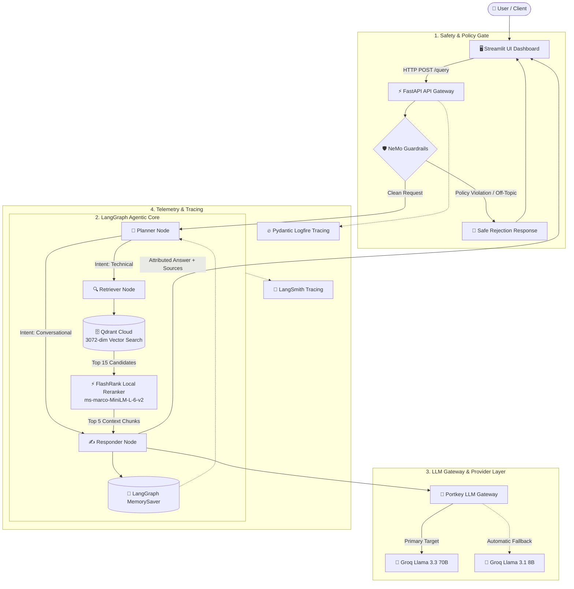

# NEXUS-RAG

### Anuj's Enterprise eXplainable Unified Search & RAG

> **"Agentic Document Intelligence for Reliable Enterprise Search"**
> 
> *Author: **Anuj Kekre***

---

## Overview

**NEXUS-RAG** is an agentic enterprise document intelligence and semantic search platform architected for high-accuracy information retrieval across complex organizational knowledge bases. Combining cyclic multi-step reasoning, dual-stage hybrid retrieval, semantic cross-encoder reranking, and proactive safety guardrails, NEXUS-RAG delivers explainable, citation-backed answers while preventing hallucination and unauthorized prompt manipulation.

The platform distinguishes between conversational dialogue and deep technical queries, executing dynamic query planning before touching the vector database, and streaming verified responses enriched with document attribution and execution status telemetry.

---

## Problem Statement

Modern enterprise document repositories are vast, multi-format, and noisy. Standard keyword search engines (BM25, lexical indexers) fail to capture semantic intent, while naïve RAG (Retrieval-Augmented Generation) pipelines suffer from critical enterprise vulnerabilities:

1. **Semantic Ambiguity & Noise**: Raw cosine similarity in high-dimensional vector spaces frequently retrieves superficially matching but factually irrelevant text chunks.
2. **Lack of Query Planning**: Standard RAG treats every query identically—running expensive, redundant vector lookups even for simple greetings or multi-turn conversational follow-ups.
3. **Hallucination & Misattribution**: Without cross-encoder verification, LLMs synthesize answers using low-confidence context chunks, creating plausible-sounding fabrications.
4. **Safety & Policy Violations**: Direct LLM interfaces are vulnerable to prompt injections, jailbreaks, and off-topic compute drain.
5. **Zero Observability**: Black-box execution prevents platform engineers from tracing why a specific document chunk was selected or why a query took a specific execution path.

**NEXUS-RAG** solves these challenges with an end-to-end, multi-stage agentic workflow designed for deterministic reliability, safety, and sub-second reranking.

---

## Key Features

- 🧠 **Agentic Query Planning**: State-machine orchestration powered by **LangGraph** to classify intent, reformulate queries, and preserve conversational memory.
- 💬 **Conversational Memory**: Checkpointed state management (`MemorySaver`) maintaining multi-turn context across threads without redundant retrieval.
- 🛡️ **Proactive Safety Guardrails**: **NeMo Guardrails** gate evaluating Colang safety policies, intercepting prompt injections and off-topic abuse *before* vector lookup.
- 🔎 **Two-Stage Hybrid Retrieval**:
  - **Stage 1 (Bi-Encoder)**: Sub-10ms candidate retrieval from **Qdrant Cloud** vector database.
  - **Stage 2 (Cross-Encoder)**: Local ONNX-quantized **FlashRank** reranking to re-score candidate relevance with zero external API latency.
- 🔢 **High-Dimensional Embeddings**: Google **Gemini** (`gemini-embedding-2-preview`, 3072 dimensions) with automatic exponential backoff retry and local fallback.
- 🌐 **Resilient LLM Gateway**: **Portkey Gateway** integration providing automated failover routing between primary (Groq Llama 3.3 70B) and secondary backup models, telemetry tagging, and semantic response caching.
- 📥 **Universal Multi-Format Ingestion**: On-device parsing for PDF (`pypdf`, `pdfplumber`), HTML (`BeautifulSoup4`), Word (`python-docx`), PowerPoint (`python-pptx`), and plain text without external OCR dependencies.
- 📡 **Dual Observability**: Comprehensive distributed tracing via **Pydantic Logfire** (system, database, latency spans) and **LangSmith** (agent state transitions and prompt tracking).
- 🧪 **Standardized RAG Evaluation**: Automated evaluation suite measuring **Faithfulness**, **Answer Relevancy**, **Context Precision**, **Context Recall**, **Answer Correctness**, and **Tool Selection Correctness (Jaccard Metric)**.

---

## Architecture



---

## Tech Stack

| Component | Technology | Purpose |
| :--- | :--- | :--- |
| **Agent Orchestration** | LangGraph & LangChain | State machine graphs, conditional routing, cyclic planning, and thread memory. |
| **Web & API Framework** | FastAPI & Uvicorn | High-performance asynchronous REST API with Pydantic schema validation. |
| **LLM Gateway** | Portkey AI | Unified gateway for fallback routing, retry strategies, and response caching. |
| **Reasoning Models** | Groq (Llama 3.3 70B & Llama 3.1 8B) | Ultra-low latency reasoning for planning, generation, and evaluation judging. |
| **Safety Guardrails** | NVIDIA NeMo Guardrails | Colang-based intent gating, jailbreak prevention, and conversational dialog control. |
| **Vector Database** | Qdrant Cloud | High-scale vector indexing, payload storage, and cosine distance search. |
| **Semantic Reranker** | FlashRank (Local ONNX) | Zero-API-cost cross-encoder reranking running locally on CPU (`<100ms`). |
| **Embeddings** | Google Gemini (`gemini-embedding-2-preview`) | 3072-dimensional dense embeddings for high-fidelity technical semantic search. |
| **Document Ingestion** | `pypdf`, `pdfplumber`, `BeautifulSoup4`, `python-docx`, `python-pptx` | On-device parsing across PDF, HTML, Word, PowerPoint, and Text files. |
| **Observability** | Pydantic Logfire & LangSmith | Distributed span tracking, latency measurement, and LLM prompt telemetry. |
| **Evaluation Suite** | RAGAS & Custom Jaccard Tool Evaluator | Multi-dimensional scoring across faithfulness, precision, recall, and correctness. |
| **User Interface** | Streamlit | Responsive dashboard with status telemetry, memory management, and source inspector. |

---

## Project Structure

```text
NEXUS-RAG/
├── app/
│   ├── agents/
│   │   ├── nodes/
│   │   │   ├── planner.py         # Query classification & search term optimization
│   │   │   ├── retriever.py       # Vector search query & FlashRank reranking orchestration
│   │   │   └── responder.py       # Grounded synthesis with Portkey caching & citations
│   │   ├── graph.py               # LangGraph state machine & conditional edge definition
│   │   └── state.py               # Typed state schema with memory append reducers
│   ├── gateway/
│   │   ├── __init__.py
│   │   └── client.py              # Portkey client configuration & ChatOpenAI proxy adapter
│   ├── guardrails/
│   │   ├── __init__.py
│   │   ├── colang_rules.py        # Colang intent rules, safety flows & trigger indicators
│   │   └── rails.py               # NeMo LLMRails singleton & execution gate
│   ├── ingestion/
│   │   ├── chunking/
│   │   │   └── splitter.py        # Paragraph-aware semantic text chunker (1500 char max)
│   │   ├── loaders/
│   │   │   ├── html.py            # BeautifulSoup HTML parser with DOM sanitization
│   │   │   ├── office.py          # Word (.docx) & PowerPoint (.pptx) extractors
│   │   │   ├── pdf.py             # Local pypdf extractor with pdfplumber fallback
│   │   │   └── text.py            # Plain text reader
│   │   └── processor.py           # Universal ingestion CLI: parse -> chunk -> embed -> index
│   ├── services/
│   │   └── retrieval/
│   │       ├── embedding.py       # Gemini 3072-dim embeddings with exponential backoff
│   │       ├── qdrant_service.py  # Qdrant client connection & point query execution
│   │       └── ranking_service.py # Lazy-loaded local FlashRank cross-encoder engine
│   ├── config.py                  # Pydantic centralized configuration & env loader
│   └── main.py                    # FastAPI entrypoint, health endpoint & /query handler
├── ui/
│   ├── app.py                     # Primary Streamlit dashboard with execution indicators
│   └── st_cloud_ui.py             # Streamlit Cloud deployment variant
├── evals/
│   ├── app.py                     # Streamlit 3-tab evaluation portal
│   ├── pipeline.py                # Live pipeline response collector & tool detector
│   ├── metrics.py                 # RAGAS 6-metric asynchronous evaluation pipeline
│   ├── guardrails_eval.py         # Binary confusion matrix evaluator for safety rails
│   ├── data_parser.py             # Document ground truth chunk builder
│   └── golden_dataset.json        # 15 golden Q&A samples + 6 guardrail test cases
├── DATA/
│   ├── true_data/                 # Ground truth technical documentation (Kubernetes, etc.)
│   └── noisy_data/                # Synthetic distractors for robustness testing
├── DOCS/                          # Comprehensive technical architecture & operational guides
├── notebooks/                     # Interactive research & evaluation notebooks
├── requirements.txt               # Complete dependencies for local execution
├── requirements-prod.txt          # Lightweight production container dependencies
├── Dockerfile                     # Multi-stage production container build definition
├── .env.example                   # Environment variable template
└── .gitignore                     # Security-hardened git exclusion rules
```

---

## How It Works

1. **User Query Ingestion**: The user submits a question through the Streamlit interface or REST API to `/query`.
2. **Guardrail Safety Gate**: **NeMo Guardrails** evaluates the input against Colang policies. Adversarial prompts, system prompt extractions, or off-topic requests are intercepted immediately with a polite refusal, saving downstream LLM compute.
3. **Agentic Query Planning**: If clean, the request enters the **LangGraph Planner**. The Planner inspects conversation history:
   - *Conversational*: Routed directly to the Responder node without touching the vector database.
   - *Technical*: The Planner refines the user question into an optimal search query.
4. **Vector Retrieval (Bi-Encoder)**: The search query is vectorized into 3072 dimensions using **Gemini Embeddings** and queried against **Qdrant Cloud**, retrieving the top 15 candidate chunks.
5. **Cross-Encoder Reranking**: The 15 candidates are passed to **FlashRank** locally. The cross-encoder evaluates query-document pairs simultaneously, filtering out noise and selecting the top 5 most relevant passages.
6. **Context Construction & Synthesis**: The **Responder Node** builds a grounded prompt containing the verified context, conversation history, and source metadata.
7. **Gateway Execution**: The prompt is dispatched through **Portkey Gateway** to Groq Llama 3.3 70B (with automatic failover to Llama 3.1 8B if rate-limited).
8. **Memory Checkpoint**: The state and response are committed to `MemorySaver` under the user's `thread_id`.
9. **UI Presentation**: The Streamlit frontend renders safe execution status indicators, streams the response, and displays expandable source citations.

---

## Installation

### Prerequisites
- Python 3.11+
- Windows PowerShell / Command Prompt or Linux/macOS Bash
- Git

### Step-by-Step Setup (Windows PowerShell)

```powershell
# 1. Clone or navigate to the repository
git clone https://github.com/anujkekre/NEXUS-RAG.git
cd NEXUS-RAG

# 2. Create a virtual environment
python -m venv venv

# 3. Activate the virtual environment
.\venv\Scripts\Activate.ps1

# 4. Upgrade pip and install dependencies
python -m pip install --upgrade pip
pip install -r requirements.txt
```

---

## Environment Variables

Create a `.env` file in the project root by copying `.env.example`:

```powershell
Copy-Item .env.example .env
```

Configure the following variables in `.env`:

| Variable | Required | Description |
| :--- | :--- | :--- |
| `GROQ_API_KEY` | **Yes** | Primary Groq API key for Llama 3.3 70B reasoning. |
| `GROQ_FALLBACK_API_KEY` | Optional | Secondary Groq key for Portkey fallback target. |
| `PORTKEY_API_KEY` | **Yes** | Portkey Gateway API key for routing and caching. |
| `QDRANT_CLUSTER_ENDPOINT` | **Yes** | Qdrant Cloud URL (`https://your-cluster.cloud.qdrant.io:6333`). |
| `QDRANT_API_KEY` | **Yes** | Qdrant Cloud API access key. |
| `GEMINI_API_KEY` | **Yes** | Google Gemini API key for `gemini-embedding-2-preview`. |
| `LOGFIRE_TOKEN` | Optional | Pydantic Logfire token for distributed tracing. |
| `LANGSMITH_TRACING` | Optional | Set to `"true"` to enable LangSmith tracing. |
| `LANGSMITH_API_KEY` | Optional | LangSmith API key. |
| `LANGSMITH_PROJECT` | Optional | LangSmith project name (defaults to `nexus-rag-prod`). |
| `BACKEND_URL` | Optional | API URL for Streamlit (defaults to `http://localhost:8000`). |
| `JUDGE_GROQ` | Optional | Dedicated Groq key for RAGAS evaluation judge. |

---

## Running Locally

### 1. Ingest Knowledge Documents

Parse documents in `DATA/`, generate embeddings, and index into Qdrant:

```powershell
# Drops and recreates the collection before indexing
python -m app.ingestion.processor DATA --wipe
```

### 2. Launch FastAPI Backend

```powershell
uvicorn app.main:app --reload --port 8000
```
*API Swagger Documentation: [http://localhost:8000/docs](http://localhost:8000/docs)*  
*Health Check: [http://localhost:8000/health](http://localhost:8000/health)*

### 3. Launch Streamlit UI Dashboard

In a new terminal (with `venv` activated):

```powershell
streamlit run ui/app.py
```
*Dashboard will open at [http://localhost:8501](http://localhost:8501)*

### 4. Launch RAGAS Evaluation Portal (Optional)

```powershell
streamlit run evals/app.py
```

---

## Evaluation

NEXUS-RAG includes a dedicated evaluation framework built on **RAGAS** and custom deterministic metrics, testing performance against a 15-sample enterprise ground truth dataset:

1. **Faithfulness**: Quantifies whether the generated answer is strictly derived from the retrieved context (detecting hallucinations).
2. **Answer Relevancy**: Evaluates how directly the answer addresses the user's question without extraneous filler.
3. **Context Precision**: Measures the signal-to-noise ratio in retrieved context chunks.
4. **Context Recall**: Verifies that all necessary ground-truth facts were retrieved.
5. **Answer Correctness**: Assesses semantic and factual accuracy compared against expert reference answers.
6. **Tool Selection Correctness**: Deterministic Jaccard similarity between expected agent actions and actual graph execution paths (computed with zero LLM cost).
7. **Guardrails Binary Matrix**: Computes Precision, Recall, and Accuracy of the NeMo safety gate on adversarial vs. legitimate inputs.

---

## Design Decisions

| Decision | Alternative Considered | Engineering Rationale |
| :--- | :--- | :--- |
| **LangGraph State Machine** | Linear LangChain Chains | Allows cyclic reasoning, state inspection, and clean separation between planning, retrieval, and response synthesis. |
| **FlashRank Local Reranker** | Cohere Rerank API | Eliminates per-query API costs and latency; runs locally via quantized ONNX on standard CPU in `<100ms`. |
| **Qdrant Vector Database** | ChromaDB / Pinecone | High-performance Rust engine with native payload filtering and cloud clustering. |
| **Portkey LLM Gateway** | Direct Groq SDK calls | Provides unified rate-limit retries, automatic failover to backup models, and edge caching without modifying core agent logic. |
| **NeMo Guardrails Gate** | In-prompt system instructions | In-prompt instructions can be bypassed via prompt injection. NeMo provides a semantic classification barrier before retrieval. |
| **Gemini 3072-dim Embeddings** | OpenAI text-embedding-3-small | Superior domain representation on complex technical and infrastructure documentation. |

---

## Limitations

- **Cloud Vector Dependency**: Default setup connects to Qdrant Cloud (requires active internet access; local Qdrant container can be configured).
- **Free Tier Rate Limits**: When running large batch evaluations on free-tier LLM endpoints, cooldown intervals are enforced to respect rate limits.
- **Complex Scanned PDF OCR**: Ingestion relies on local text extraction (`pypdf` / `pdfplumber`); purely image-based scanned PDFs require an upstream OCR engine.

---

## Future Improvements

- [ ] Hybrid sparse-dense retrieval (BM25 + Qdrant dense vector fusion).
- [ ] Multi-document cross-referencing with recursive document summary agents.
- [ ] Dynamic chunk sizing based on semantic boundary detection.
- [ ] Async background document indexing via Celery / Redis task queues.
- [ ] Local Ollama / vLLM execution profile for 100% offline air-gapped environments.

---

## Author

**Anuj Kekre**  
*AI / ML Engineer & Technical Architect*  
Project: **NEXUS-RAG (Anuj's Enterprise eXplainable Unified Search & RAG)**
